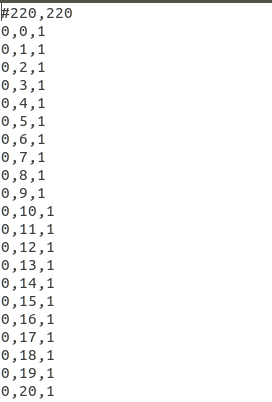

# Anytime-Astar-with-other-variations
Compilation of Anytime A*, Weighted A* and regular A* algorithms into single repository written in python for comparison. Any of the variation can be used using appropriate command line arguments.


## Overview
The repository contains implementation of Anytime A* algorithm as an extension of weighted A*. Anytime A* is used to find the best plan within given time limit. To do this, we begin with weighted A* search with very high weight value which provides us an suboptimal plan. If the plan is found and the planner has some more time left, we reduce the weiht value and repeat the process. If and when the weight values becomes 1, we return the optimal path or else we use the bounded suboptimal path.

## Installation and Implementation
**Step 1: Clone this repository.**
```shell
git clone https://github.com/tan-may16/Anytime-AStar-algorithm-with-other-AStar-variations.git
```

**Step2: Run the A_star.py file with appropriate required arguments to visualize and test results.**
```shell
cd Anytime-AStar-algorithm-with-other-AStar-variations
python A_star.py --x_start 50 --y_start 50 --x_end 150 --y_end 150 --collision_thresh 51 --max_time 1 --weight 5
```

## Command Line Arguments
x_start: X coordinate of starting position. (Current position of robot) 
y_start: Y coordinate of starting position. (Current position of robot)  
x_end: X coordinate of end position. (Goal/Target position)  
y_end: Y coordinate of end position. (Goal/Target position) 
collision_thresh: Obstacle threshold in the map. (Any value equal to and above the threshold is considered as an obstacle)
max_time: Maximum time given for the planner to plan the path (in secconds) 
weight: The weight value in the weighted A* algorithm
txt_path: file path of the txt file. (Default is "office_map.txt")

## TXT file format


The above image is a screenshot of the part of the sample txt file (office_map.txt). 
The first line indicates the dimension of the map in the following format: # x_size, y_size
All other lines provide the map data in the following format: x_coordinate, y_coordinate, value

**Note**: If the above format cannot be used for some reason, you can write your own txt parser by changing the "read_txt" function in the util.py.

## Sample Example
* **Gazebo world used in the example**


The above gazebo world was downloaded from https://github.com/leonhartyao/gazebo_models_worlds_collection.
The gazebo world was converted into pgm file using the following 2D gazebo plugin - https://github.com/marinaKollmitz/gazebo_ros_2Dmap_plugin

* **Sample Path generated from (50,50) to (150,150)**


**Color correspondence**
Green: Path of the robot
Violet: Area explorable by the robot and below the threshold
Yellow: Obstacles. (Can be explored by robot if threshold is increased)
Blue/faint violet: Area that cannot be explored by the robot. (Area where the map information is missing because the pgm converter robot could not reach that space)

